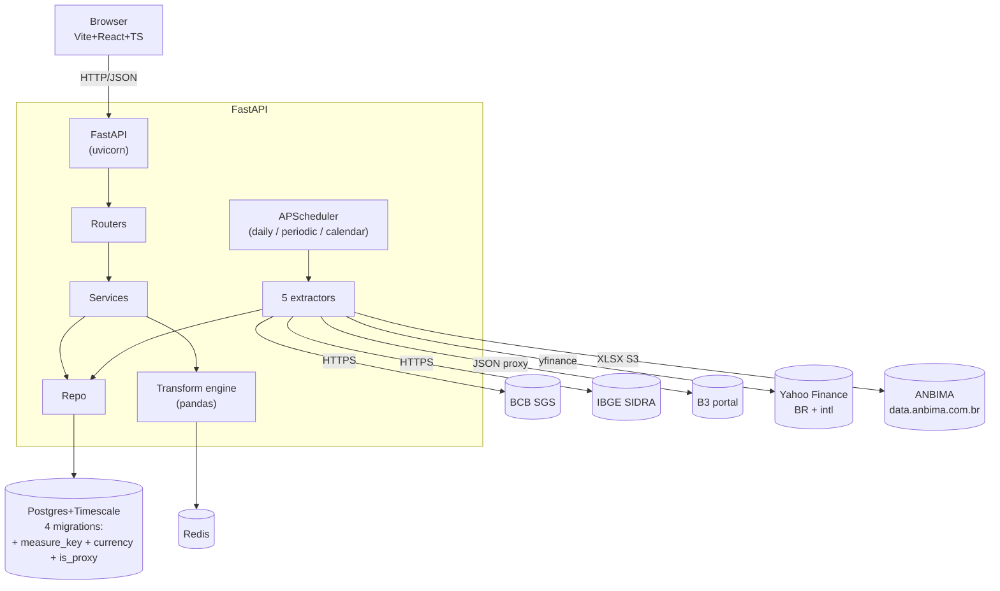
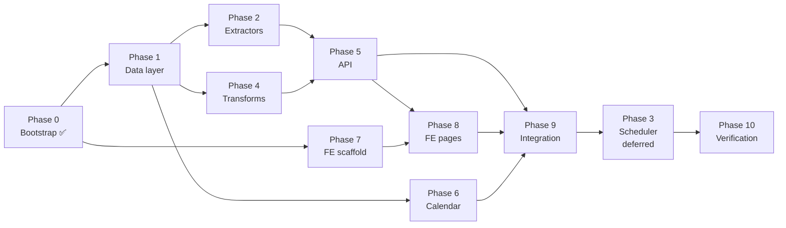
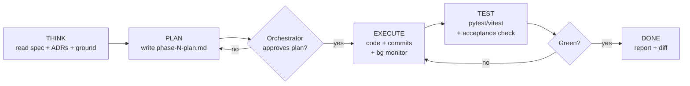

# API-extractor — Build Plan

**Version:** v1
**Date:** 2026-05-11
**Owner:** single user (local deploy)
**Source design:** `API-extractor/DOCUMENTACAO.md`
**Spec:** `specs/api-extractor.spec.md`
**Architecture:** `docs/architecture/system-design.md`
**ADRs:** `docs/adr/`

---

## 1. Vision

Personal workspace consulting + extracting **72 economic indicators** (Brazilian macro, fixed-income ANBIMA family, B3 ESG/governance indexes, international indexes). Scheduled extraction from 5 sources, time-series storage, on-demand pandas transforms, React/TS frontend with pinned dashboard + catalog + calendar + metadata dossier.

**Primary success metric:** 72/72 series ingested with viable history (full history where source allows).

**v1 → Phase 21 status (current):** 72 series, 12 categories, 5 adapters (BCB SGS · IBGE SIDRA · B3 portal · Yahoo Finance · ANBIMA bulk XLSX), 4 migrations, 316 BE + 316 FE tests green.

---

## 2. Locked decisions (Common Ground)

| Area | Choice |
|---|---|
| Backend | Python 3.12 + FastAPI + Pydantic v2 |
| Frontend | Vite + React 18 + TypeScript |
| Database | Postgres 16 + TimescaleDB |
| Cache | Redis 7 |
| Scheduler | APScheduler `AsyncIOScheduler` in FastAPI process |
| Transform exec | Server-side, on-demand, pandas |
| API contract | REST + OpenAPI → `openapi-typescript` codegen |
| Data sources | BCB SGS, IBGE SIDRA, B3 portal, Yahoo Finance (BR + intl), ANBIMA (bulk XLSX from S3) |
| Backfill | Full history per series |
| Deploy | Docker Compose, local single-user, no auth |
| UI state | Postgres `user_prefs` table |
| Failure policy | tenacity 3x exp backoff → `stale` + log |
| Tests | pytest (transforms + extractor contracts) |

---

## 3. Architecture (one-screen)



4 containers in Docker Compose: `api`, `postgres`, `redis`, `web`.

---

## 4. Data model

### Tables (after migration 0004)
- `series` — code PK, name, category, source, source_id, frequency, unit, **currency** (default BRL), **is_proxy** (default false), first_observation, last_extraction_at, last_success_at, status, metadata jsonb, **measures jsonb (default [])**
- `observations` — TimescaleDB hypertable, PK `(series_code, **measure_key**, observed_at)`, value numeric, ingested_at
- `revisions` — series_code, **measure_key**, observed_at, old_value, new_value, revised_at
- `releases` — series_code, scheduled_for, status (`expected`/`realized`), source_type (`scraped`/`hardcoded`/`inferred`), UNIQUE(series_code, scheduled_for)
- `user_prefs` — id (single row), recents jsonb, updated_at
- `pin` — user_prefs_id, series_code, order
- `card_transform` — user_prefs_id, series_code, transform_spec jsonb
- `apscheduler_jobs` — auto-created by APScheduler SQLAlchemyJobStore (3 jobs persisted)

### Migration log
- `0001_initial` — 7 tables + observations hypertable
- `0002_releases_unique_index` — UNIQUE(series_code, scheduled_for)
- `0003_multi_measure` — `series.measures`, `observations.measure_key` (PK widened), `revisions.measure_key`
- `0004_currency_proxy` — `series.currency` (BRL/USD/EUR), `series.is_proxy`

### Index
- `observations` (series_code, observed_at DESC) — sparkline reads
- TimescaleDB chunk by month on `observed_at`

---

## 5. API surface

| Method | Path | Purpose |
|---|---|---|
| GET | `/series` | List + status |
| GET | `/series/{code}` | Metadata |
| GET | `/series/{code}/observations?from=&to=&limit=` | Raw obs |
| POST | `/series/{code}/transform` | Body: `TransformSpec` |
| GET | `/releases?month=YYYY-MM&category=` | Calendar events |
| GET | `/user_prefs` | Pins + transforms + recents |
| PATCH | `/user_prefs` | Update prefs |
| POST | `/admin/extract/{code}` | Manual trigger |
| GET | `/health` | Per-series freshness |

`TransformSpec`:
```json
{
  "op": "yoy" | "mom" | "qoq" | "annualized" | "diff" | "log_diff" | "pp"
      | "ma" | "ewma" | "accum12" | "stddev12"
      | "rebase" | "zscore" | "percentile"
      | "level" | "sa" | "calendar_adj",
  "params": { "window": 12, "base": 100, "span": 6 }
}
```

---

## 6. Phased delivery

### Phase 0 — Bootstrap (1 day)
- [ ] Repo skeleton: `backend/`, `frontend/`, `infra/`, `docs/`
- [ ] `docker-compose.yml`: api + postgres(timescale) + redis + web
- [ ] `.env.example` with DB_URL, REDIS_URL
- [ ] `Makefile` targets: `up`, `down`, `migrate`, `seed`, `test`
- [ ] Pre-commit hooks: ruff, black, mypy, openapi-typescript

### Phase 1 — Data layer (2 days)
- [ ] FastAPI project, Pydantic settings via `pydantic-settings`
- [ ] SQLAlchemy 2.x async + Alembic
- [ ] DDL migrations for 7 tables
- [ ] `SELECT create_hypertable('observations', 'observed_at')`
- [ ] Seed `series` (25 rows: code, name, category, source, source_id, frequency, unit, first_observation)
- [ ] Repository layer: `SeriesRepo`, `ObservationRepo`, `ReleaseRepo`, `UserPrefsRepo`
- [ ] Unit tests on repo CRUD

### Phase 2 — Extractors (3 days)
- [ ] **Research first** — WebSearch + WebFetch official docs for each source:
  - BCB SGS: endpoint format, query params, date format, JSON shape, rate limits
  - IBGE SIDRA: API URL builder, table IDs, period syntax, variable codes
  - B3 / Yahoo Finance: `yfinance` usage for `^BVSP` + `IFIX.SA`, fallback APIs
- [ ] **Document findings BEFORE coding** — write `docs/data-sources/{source}.md` per source covering:
  - Auth model (none / token / IP allowlist)
  - Endpoint(s) with concrete example URLs
  - Request params + date formats
  - Response schema (sample payload, field meanings)
  - Pagination / batching rules
  - Rate limits + recommended throttle
  - Quirks (revisions, missing data, holidays)
  - Sample `curl` for each of the 25 series IDs
- [ ] Source adapter interface: `async def fetch(series, since) -> list[Observation]`
- [ ] `BCBSGSAdapter` — `httpx.AsyncClient`, JSON parse
- [ ] `IBGESidraAdapter` — SIDRA query builder + parser
- [ ] `B3YahooAdapter` — `yfinance` wrapper
- [ ] Idempotent upsert (`ON CONFLICT (series_code, observed_at)`)
- [ ] Revision detection (compare value, append row to `revisions`)
- [ ] `tenacity` retry 3x exp backoff
- [ ] `pg_advisory_lock(series_code)` to prevent concurrent backfill
- [ ] CLI: `python -m api_extractor.bootstrap [--series CODE]`
- [ ] Pytest: mock upstream HTTP using payloads captured during research step
- [ ] Cross-link each `series.seed.json` entry to its data-sources doc section

### Phase 3 — Scheduler (1 day) — **deferred to end (post-integration)**
Rationale: manual extraction CLI from Phase 2 proves correctness first. Scheduler is automation on top of working extractors. No point automating something not yet proven against real data.

- [ ] `AsyncIOScheduler` registered in FastAPI lifespan
- [ ] Job config from `series.frequency`:
  - daily → cron `0 18 * * 1-5` BRT
  - monthly/quarterly → cron `0 9 * * *` poll
- [ ] `misfire_grace_time=3600`
- [ ] Calendar refresh weekly Sunday 03:00
- [ ] On final fail: set `series.status = 'stale'` + log
- [ ] Health endpoint reports freshness summary
- [ ] `apscheduler_jobs` table: let APScheduler auto-create at runtime (NOT via Alembic)
- [ ] Verify scheduler restart preserves missed runs via SQLAlchemyJobStore

### Phase 4 — Transform engine (2 days)
- [ ] Registry pattern: `TRANSFORMS: dict[str, Callable]`
- [ ] Implement ops:
  - **Original:** `level`, `sa` (stub), `calendar_adj` (stub)
  - **Variation:** `mom`, `qoq`, `yoy`, `annualized`, `diff`, `log_diff`, `pp`
  - **Smoothing:** `ma` (window=3/6/12), `ewma` (span param)
  - **Windows:** `accum12`, `stddev12`
  - **Normalization:** `rebase` (base=100), `zscore`, `percentile`
- [ ] NaN gap detection + metadata
- [ ] Redis cache key: `transform:{code}:{sha256(spec)}:{latest_observed_at}`
- [ ] TTL by frequency: daily=1h, monthly=24h, quarterly=7d
- [ ] Pytest: numeric correctness vs reference values (use IBGE published YoY as ground truth)

### Phase 5 — API + OpenAPI (2 days)
- [ ] Routers per resource (`series`, `transform`, `releases`, `user_prefs`, `health`, `admin`)
- [ ] Pydantic request/response models
- [ ] Input validation: ISO-8601 dates, range bounds, series existence
- [ ] Error handlers: 404/422/503 with structured detail
- [ ] OpenAPI export script: `python -m api_extractor.openapi > openapi.json`
- [ ] Pytest: API contract tests via `httpx.AsyncClient`

### Phase 6 — Calendar scraper (1 day)
- [ ] IBGE calendar scraper (HTML parse)
- [ ] BCB calendar scraper
- [ ] Hardcoded fallback: `data/calendar.json`
- [ ] Source-type tagging on insert
- [ ] Manual override field (admin endpoint)

### Phase 7 — Frontend scaffold (1 day)
- [ ] `npm create vite@latest frontend -- --template react-ts`
- [ ] `pnpm add @tanstack/react-query react-router-dom openapi-fetch zustand`
- [ ] `pnpm add -D openapi-typescript`
- [ ] Codegen script: `openapi-typescript http://localhost:8000/openapi.json -o src/api/schema.ts`
- [ ] Fonts via `@fontsource/instrument-serif` + `@fontsource/ibm-plex-{sans,mono}`
- [ ] CSS variables matching doc §8 tokens
- [ ] Tailwind optional (or vanilla CSS modules)

### Phase 8 — Frontend pages (4 days)
- [ ] Sidebar (collapse 320ms, recents, footer pulse)
- [ ] Router (4 routes)
- [ ] Page Índices: search + tabs + card grid + star pin
- [ ] Page Painel: small-multiples grid, category toggle, sparkline (SVG, 24 obs), delta, transform badge, 14-day strip
- [ ] Page Calendário: 7-col month grid, E/R chips, month nav, category filter
- [ ] Page Metadados: two-col layout, sticky list, dossier card
- [ ] TransformModal: 5 radio groups, Aplicar/Cancelar
- [ ] Empty states (Painel, Índices)
- [ ] Motion per doc §9 (320ms sidebar, 18ms chip stagger, 220ms modal)
- [ ] Loading skeletons per page

### Phase 9 — Integration + polish (2 days)
- [ ] pt-BR locale: `Intl.DateTimeFormat('pt-BR')`, `Intl.NumberFormat('pt-BR')`
- [ ] Delta color rules per category (higher=better vs higher=worse)
- [ ] Sync indicator wired to `/health`
- [ ] Manual refresh button → `POST /admin/extract/{code}`
- [ ] Recents tracked client-side, synced via PATCH `/user_prefs`
- [ ] README + run instructions

### Phase 10 — Verification (1 day)
- [ ] Bootstrap real DB with all 25 series + full history
- [ ] Walk through 7 acceptance criteria from spec
- [ ] Smoke: pin → transform → unpin → calendar nav → metadata
- [ ] Confirm `/health` shows 25/25 `fresh`
- [ ] Verify Painel render ≤ 1.5s, transform p95 ≤ 800ms

### Phase 11–17 — UI/UX polish + AnalysisPanel (post-v1)
- Phase 11: Painel sparkline/card/calendar strip sizing
- Phase 12: improvements.md round 1 (unit position, agenda 30d, sidebar size)
- Phase 13: collapsed sidebar SVG icons (Painel/Índices/Calendário/Metadados)
- Phase 14: Índices fixed page + scroll, source clustering, info popover
- Phase 15: Calendário nav transformed into card w/ month + year selectors
- Phase 16: Metadados no-auto-open + scroll + source cluster + top-align
- Phase 17: AnalysisPanel (replaces /metadados navigation on card click) + Chart component (line/bar/area animated) + Salvar imagem/dados

### Phase 18 — Multi-measure series (in progress)
Same series accessible via multiple measures (forms). Status: **Stage 1 (schema + models) complete**. Stages 2–5 deferred.

Stage 1 deliverables:
- Migration `0003_multi_measure.py` — adds `series.measures` jsonb, `observations.measure_key` + PK widened to (series_code, measure_key, observed_at), `revisions.measure_key`
- Models updated, reversible downgrade tested
- 240 BE tests green (backwards-compatible — default measure_key='default')

Series targeted for multi-measure (post-stage-1):
- **PIB:** `pct_qoq` / `pct_yoy` / `idx_volume`
- **IBC-Br:** `idx` / `pct_mom` / `pct_yoy`
- **IPCA:** `pct_mom` / `pct_12m` (índice deferred)
- **Ibovespa:** `close` / `pct_daily` (derived)
- **Reservas_Internacionais:** `total` / `liquidez`

Remaining stages: seed enrichment, extractor multi-measure dispatch, services, routers, frontend selector.

### Phase 19 — Diariamente row on Painel
- New `DailyRow` component listing 7 daily-frequency series (SELIC, CDI, TR, PTAX_USD, PTAX_EUR, Ibovespa, IFIX) as compact chips under the calendar section
- Reads `useSeries` + `useHealth` + `useObservations` per chip
- Click chip → opens AnalysisPanel
- Backend `daily_batch` scheduler job confirmed firing (8 codes, ~4s) Mon-Fri 18:00 BRT

**Total estimate:** ~20 working days for v1.

---

## 6b. Agent delegation — parallel execution

Each phase dispatched to Sonnet subagent loading specific skills. Orchestrator (Opus) coordinates waves, reviews output, runs `simplify` + `code-reviewer` between waves. Parallel agents dispatched in single message w/ multiple `Agent` tool calls per Claude Code parallel-agent pattern.

### Dependency DAG



### Wave plan (parallel batches)

| Wave | Parallel phases | Sequential gate |
|---|---|---|
| **W0** | Phase 0 alone | ✅ DONE — infra running |
| **W1** | Phase 1 ∥ Phase 7 | Backend data layer + FE scaffold independent |
| **W2** | Phase 2 ∥ Phase 4 ∥ Phase 6 | All need Phase 1 schema; mutually independent |
| **W3** | Phase 5 alone | API needs extractors (P2) + transforms (P4) |
| **W4** | Phase 8 alone | Needs Phase 5 OpenAPI schema + Phase 7 FE scaffold |
| **W5** | Phase 9 alone | Glue layer, single agent for coherence |
| **W6** | Phase 3 alone | Scheduler — moved to end; automates extraction after manual extraction proven |
| **W7** | Phase 10 alone | Acceptance run after everything green |

### Subagent matrix

| Phase | Subagent type | Primary skill | Supporting skills | Deliverables |
|---|---|---|---|---|
| 0 | `devops-engineer` | `devops-engineer` | `update-config` | docker-compose, Makefile, pre-commit |
| 1 | `python-pro` | `postgres-pro` | `sql-pro`, `python-pro` | Alembic migrations, hypertable DDL, repos |
| 2 | `python-pro` (×3 parallel sources) | `python-pro` | `fastapi-expert`, `monitoring-expert` | **`docs/data-sources/{src}.md` (research output)** + 3 adapters + tenacity + contract tests using captured fixtures |
| 3 | `python-pro` | `fastapi-expert` | `monitoring-expert`, `sre-engineer` | APScheduler + health endpoint |
| 4 | `pandas-pro` | `pandas-pro` | `python-pro`, `test-master` | Transform registry + Redis cache |
| 5 | `fastapi-expert` | `fastapi-expert` | `api-designer`, `secure-code-guardian` | Routers + OpenAPI export |
| 6 | `python-pro` | `python-pro` | — | IBGE/BCB scrapers + fallback |
| 7 | `react-expert` | `react-expert` | `typescript-pro` | Vite + RT-Query + codegen pipeline |
| 8 | `react-expert` (×4 parallel pages) | `react-expert` | `frontend-design`, `ui-ux-pro-max`, `typescript-pro` | 4 pages + sidebar + modal |
| 9 | `fullstack-guardian` | `fullstack-guardian` | `javascript-pro` | Locale, sync, polish |
| 10 | `test-master` | `test-master` | `debugging-wizard`, `the-fool` | Acceptance run + smoke |
| cross | `simplify` | `simplify` | `karpathy-guidelines` | Between waves: trim, dedupe |
| cross | `code-reviewer` | `code-reviewer` | `security-reviewer` | After each wave: review diff |

### Intra-phase parallelism

Phases with independent units fan out to multiple agents:

- **Phase 2 (extractors)** — 3 agents in parallel, one per source: BCB SGS, IBGE SIDRA, B3/Yahoo. Each agent has WebSearch + WebFetch tools and MUST execute a **research sub-step** before coding:
  1. WebSearch official docs for the source
  2. WebFetch endpoint examples + sample responses
  3. Write `docs/data-sources/{source}.md` (auth, endpoints, params, response schema, rate limits, quirks, curl examples per series ID)
  4. Capture real response payloads as JSON fixtures under `backend/tests/fixtures/{source}/*.json`
  5. Only then implement the adapter against the captured contract
  Each implements shared `SourceAdapter` interface from `base.py`. Merge by orchestrator.
- **Phase 8 (FE pages)** — 4 agents in parallel, one per page: Painel, Índices, Calendário, Metadados. Shared components (Sparkline, Card, Sidebar, TransformModal) built first in a mini-wave, then pages fan out.

### Per-phase lifecycle — Think → Plan → Execute → Test

Every dispatched agent (parallel or serial) MUST follow this 4-step lifecycle. Orchestrator enforces via prompt template.



**Step 1 — THINK (~5min)**
- Read `docs/PLAN.md §{N}`, relevant ADRs, spec FRs, Common Ground
- Load `karpathy-guidelines` skill (surface assumptions, define success criteria)
- List unknowns + risks
- Output: short note in agent reply, no files written

**Step 2 — PLAN (~10min)**
- Write `docs/phase-plans/phase-{N}-{slug}.md` with:
  - Files to create/edit (exact paths — establishes ownership for parallel safety)
  - Interfaces consumed (from prior phases) + produced (for downstream)
  - Test strategy (what proves done)
  - Risks + mitigations
  - Success criteria (link to spec ACs)
- Orchestrator reviews. Gate before execute.

**Step 3 — EXECUTE (variable)**
- Implement per plan
- Long-running services (Postgres, Redis, uvicorn, vite) launched via `Bash run_in_background=true`
- Background tasks tailed via `Monitor` tool for log/event streaming
- Commits per logical unit, conventional commits format
- Tight loop: edit → re-run targeted test → iterate

**Step 4 — TEST (~10min)**
- Run phase's test suite (`pytest backend/tests/test_phase_N*.py` or `vitest run`)
- Verify acceptance criteria from spec map to passing tests
- Run `simplify` skill against own diff (self-review)
- If red: back to EXECUTE; do not report green until all assertions pass

**Step 5 — DONE**
- Report: diff summary, test output, deviations, open questions, links to background services left running

### Background service monitoring

Phases that need long-running infra (DB, Redis, API, vite) start them in background. Orchestrator + agents use `Bash run_in_background=true` to launch, then `Monitor` tool to stream logs.

| Service | Phase started | How to monitor | Tear down |
|---|---|---|---|
| Postgres + Timescale | W0 | `docker compose logs -f postgres` via Monitor | `docker compose down` at end of session |
| Redis | W0 | `docker compose logs -f redis` via Monitor | same |
| FastAPI (uvicorn --reload) | W2+ | `Monitor` tail `uvicorn.log` until "Application startup complete" | Bash kill on phase end |
| Vite dev server | W4+ | `Monitor` tail `vite.log` until "ready in Xms" | same |
| APScheduler jobs | W3+ | `Monitor` tail `scheduler.log` w/ regex `job.*completed\|failed` | runs inside FastAPI process |
| Pytest watch (optional) | any | `pytest-watch` background | Bash kill |

**Monitor patterns to set:**
- `ERROR|CRITICAL|Traceback` → break loop, alert agent
- `extraction.*failed` → mark series stale check
- `job.*missed` → APScheduler misfire investigation
- `port.*in use` → restart service w/ different port

**Health gate before phase report:**
```bash
curl -fsS http://localhost:8000/health | jq '.series_status == "all_fresh"'
docker compose ps --filter "status=running" | wc -l   # expect 4
```

### Dispatch pattern (parallel)

Orchestrator sends single message w/ multiple `Agent` tool calls. Example for W2:

```
<Agent name="phase-2-bcb"
  subagent_type="python-pro"
  prompt="Phase 2 — BCB SGS adapter only. Follow Think→Plan→Execute→Test lifecycle.

  STEP 1 THINK: Read docs/PLAN.md §6 Phase 2 + §6b, docs/architecture/system-design.md §3.2-3.4,
                specs/api-extractor.spec.md FR-1, docs/adr/0005, ground file.
                Load skills: python-pro, karpathy-guidelines.
                List unknowns + risks. No file writes yet.

  STEP 2 PLAN: Write docs/phase-plans/phase-2-bcb.md:
               files owned (exact paths), interfaces consumed/produced,
               test strategy, risks, success criteria (map to spec FR-1.1..1.7).
               Stop and wait for orchestrator approval signal.

  STEP 3 EXECUTE — RESEARCH SUBSTEP first:
                  a) WebSearch: 'BCB SGS API documentation bcdata.sgs.bcb.gov.br' +
                     'BCB SGS series id list IPCA SELIC'
                  b) WebFetch: official BCB SGS docs page + 2-3 sample endpoint hits
                     (e.g. https://api.bcb.gov.br/dados/serie/bcdata.sgs.433/dados?formato=json&dataInicial=01/01/2020)
                  c) Write docs/data-sources/bcb-sgs.md (auth, endpoints, params,
                     response schema, rate limits, quirks, curl per BCB-sourced series)
                  d) Save real response payloads to backend/tests/fixtures/bcb_sgs/*.json
                  Then IMPLEMENT:
                  backend/src/api_extractor/extractors/bcb_sgs.py +
                  backend/tests/test_extractor_bcb.py. Use shared base.py.
                  Constraints: httpx.AsyncClient, tenacity 3x exp backoff,
                  idempotent upsert via ObservationRepo.
                  Launch postgres+redis via 'docker compose up -d' if not running.
                  Tail logs via Monitor: pattern 'ERROR|Traceback|extraction.*failed'.

  STEP 4 TEST: Run 'pytest backend/tests/test_extractor_bcb.py -v'.
               Verify FR-1.1, FR-1.3, FR-1.4 pass. Run simplify on own diff.
               If red: iterate execute. Do not report done until green.

  STEP 5 DONE: Report file list, test output, deviations, bg services left running,
               open questions." />

<Agent name="phase-2-ibge" ... /> (parallel)
<Agent name="phase-2-b3" ... /> (parallel)
<Agent name="phase-4-transforms" ... /> (parallel — different surface)
<Agent name="phase-6-calendar" ... /> (parallel — different surface)
```

### Conflict prevention

Parallel agents touching different files = safe. To avoid stomping:

- Each agent owns specific paths (declared in prompt)
- Shared interfaces (`base.py`, schema models) built in serial mini-wave first
- After each wave: `simplify` agent reviews union of diffs for dedup
- After each wave: `code-reviewer` agent reviews against spec FRs
- Orchestrator merges and runs full test suite before next wave

### Wave timing estimate

| Wave | Wall-clock (parallel) | Sequential equivalent |
|---|---|---|
| W0 | 1d ✅ | 1d |
| W1 | 2d (max of 2,1) | 3d |
| W2 | 3d (max of 3,2,1) | 6d |
| W3 | 2d (Phase 5 alone) | 2d |
| W4 | 4d (4 pages parallel ~1d each + glue) | 4d |
| W5 | 2d | 2d |
| W6 | 1d (Phase 3 scheduler, deferred) | 1d |
| W7 | 1d | 1d |
| **Total** | **~16d wall-clock** | **~20d serial** |

Saves ~20% wall-clock via parallelism. Higher savings possible if Phase 2 + 8 fan-out works cleanly.

### Orchestrator responsibility (you + Opus)

- Plan each wave's parallel dispatch list
- Define file-ownership boundaries per agent in prompts
- **Gate STEP 2 → STEP 3**: review each agent's `phase-plans/phase-N-*.md` before approving execute
- Keep background services healthy across waves (single docker compose stack)
- After each wave: run `simplify` + `code-reviewer`, resolve conflicts, run full test suite
- Verify against spec acceptance criteria
- Update Common Ground tier promotions if open assumptions resolve
- Gate next wave on previous wave green

### Phase plan artifacts

Each agent's STEP 2 output lives at `docs/phase-plans/phase-{N}-{slug}.md`. Pattern:

```markdown
# Phase {N}: {title}
**Agent:** {subagent_type}  **Wave:** W{x}  **Skills:** {list}

## Files owned
- create: path/to/new.py
- edit:   path/to/existing.py

## Interfaces
- consumes: {from prior phase, e.g. base.SourceAdapter, ObservationRepo}
- produces: {for downstream, e.g. BCBSGSAdapter}

## Test strategy
- contract: backend/tests/test_extractor_bcb.py::test_fetch_returns_obs
- failure:  ::test_retry_then_stale

## Acceptance criteria mapped
- FR-1.1 → test_fetch_returns_obs
- FR-1.3 → test_retry_then_stale

## Risks + mitigations
- BCB API changes JSON shape → Pydantic strict validation + golden fixture

## Background services needed
- postgres, redis (started in W0, expected up)
```

This artifact persists across sessions — picking up mid-phase is trivial.

---

## 7. Repo layout

```
API/
├── docker-compose.yml
├── .env.example
├── Makefile
├── docs/
│   ├── PLAN.md                    # this file
│   ├── architecture/
│   │   └── system-design.md
│   ├── adr/                       # 8 ADRs
│   ├── phase-plans/               # per-phase plan artifacts
│   └── data-sources/              # per-source extraction docs (Phase 2 research)
│       ├── bcb-sgs.md
│       ├── ibge-sidra.md
│       └── b3-yahoo.md
├── specs/
│   └── api-extractor.spec.md
├── backend/
│   ├── pyproject.toml
│   ├── alembic.ini
│   ├── alembic/versions/
│   ├── src/api_extractor/
│   │   ├── main.py               # FastAPI app + lifespan
│   │   ├── config.py             # pydantic-settings
│   │   ├── db.py                 # engine, session
│   │   ├── models/               # SQLAlchemy models
│   │   ├── schemas/              # Pydantic
│   │   ├── repos/                # data access
│   │   ├── services/             # business logic
│   │   ├── routers/              # FastAPI routes
│   │   ├── extractors/
│   │   │   ├── base.py
│   │   │   ├── bcb_sgs.py
│   │   │   ├── ibge_sidra.py
│   │   │   └── b3_yahoo.py
│   │   ├── transforms/
│   │   │   ├── registry.py
│   │   │   └── ops.py
│   │   ├── scheduler.py
│   │   ├── calendar_scraper/
│   │   └── bootstrap.py          # CLI
│   ├── data/
│   │   ├── series.seed.json      # 25 series metadata
│   │   └── calendar.json         # hardcoded fallback
│   └── tests/
│       ├── fixtures/             # captured upstream payloads (Phase 2 research)
│       │   ├── bcb_sgs/
│       │   ├── ibge_sidra/
│       │   └── b3_yahoo/
│       ├── test_transforms.py
│       ├── test_extractors.py
│       └── test_api.py
└── frontend/
    ├── package.json
    ├── vite.config.ts
    ├── index.html
    ├── public/
    └── src/
        ├── main.tsx
        ├── App.tsx
        ├── api/
        │   ├── schema.ts         # generated
        │   └── client.ts
        ├── pages/
        │   ├── Painel.tsx
        │   ├── Indices.tsx
        │   ├── Calendario.tsx
        │   └── Metadados.tsx
        ├── components/
        │   ├── Sidebar.tsx
        │   ├── Card.tsx
        │   ├── Sparkline.tsx
        │   ├── CategoryToggle.tsx
        │   ├── TransformModal.tsx
        │   └── CalendarStrip.tsx
        ├── hooks/
        ├── stores/               # zustand
        └── styles/
            ├── tokens.css        # doc §8 palette
            └── globals.css
```

---

## 8. The 25 series (initial seed)

| Code | Source | Source ID | Freq | Category |
|---|---|---|---|---|
| IPCA | BCB SGS | 433 | monthly | Inflação |
| IPCA-15 | BCB SGS | 7478 | monthly | Inflação |
| IGP-M | BCB SGS | 189 | monthly | Inflação |
| IGP-DI | BCB SGS | 190 | monthly | Inflação |
| INPC | BCB SGS | 188 | monthly | Inflação |
| SELIC | BCB SGS | 432 | daily | Juros |
| SELIC_meta | BCB SGS | 1178 | event | Juros |
| CDI | BCB SGS | 12 | daily | Juros |
| TR | BCB SGS | 226 | daily | Juros |
| PTAX_USD | BCB SGS | 1 | daily | Câmbio |
| PTAX_EUR | BCB SGS | 21619 | daily | Câmbio |
| Ibovespa | Yahoo | ^BVSP | daily | Mercado |
| IFIX | Yahoo (proxy) | XFIX11.SA | daily | Mercado |
| PIB_Nominal | IBGE SIDRA | 1846 (v585, R$ correntes) | quarterly | Atividade |
| PIB_Real | IBGE SIDRA | 6612 (v9318, R$ encadeados 1995) | quarterly | Atividade |
| IBC-Br | BCB SGS | 24364 | monthly | Atividade |
| Prod_Industrial | IBGE SIDRA | 8888 | monthly | Atividade |
| Vendas_Varejo | IBGE SIDRA | 8881 | monthly | Atividade |
| Desemprego | IBGE SIDRA | 4099 | quarterly | Trabalho |
| Rendimento_Medio | IBGE SIDRA | 6390 | quarterly | Trabalho |
| CAGED | BCB SGS | 28763 | monthly | Trabalho |
| Resultado_Primario | BCB SGS | 5793 | monthly | Fiscal |
| Divida_Bruta | BCB SGS | 13762 | monthly | Fiscal |
| Balanca_Comercial | BCB SGS | 22707 | monthly | Externo |
| Reservas_Internacionais | BCB SGS | 13621 | monthly | Externo |
| Conta_Corrente | BCB SGS | 22701 | monthly | Externo |

(Verify each `source_id` against live API during Phase 1 seed.)

---

## 9. Risks + watchlist

| Risk | Mitigation |
|---|---|
| BCB SGS endpoint format change | Pydantic strict validation + contract tests |
| IBGE SIDRA rate limit | Throttle + spread monthly jobs across day |
| Calendar scrape brittle | Hardcoded fallback + WARN log |
| pandas perf on long histories | Cache + window slice before transform |
| Single-user → multi-user later | `user_prefs.id` ready; add `user_id` FK in v2 migration |
| TimescaleDB upgrade pain | Pin extension version; document migration |

---

## 10. Out of scope (v1)

- Auth + multi-user
- Single-index workspace deep view (card click stub only)
- CSV/Excel export
- Alerts/notifications
- Mobile responsive

---

## 11. Open questions (Common Ground: OPEN)

1. **Logging stack** — start with `loguru` JSON to stdout; add Prometheus if it grows
2. **Extraction failure escalation** — beyond `stale` badge, want email alerts? Defer
3. **Future auth design** — schema already shaped for FK; pick `fastapi-users` when needed

---

## 12. Definition of Done (v1)

- [ ] All 25 series ingested with full history
- [ ] All 7 acceptance criteria pass
- [ ] All 4 pages functional per design doc
- [ ] Transform modal works for all 15 ops
- [ ] Calendar shows ≥ 2 months of E events
- [ ] Painel cold load ≤ 1.5s
- [ ] Restart preserves pins, transforms, observations
- [ ] README documents bootstrap + run

---

## 13. Day-1 next step

```bash
# Bootstrap repo + Docker Compose
mkdir -p backend/src/api_extractor frontend infra
touch docker-compose.yml Makefile .env.example
# Then Phase 0 checklist
```

---

## Phase 20 — Wave D — ANBIMA bulk history (COMPLETE 2026-05-11)

Replaced the per-date `ima-sh-down.asp` scraper with a single XLSX download
per index from ANBIMA's public S3 bucket
(`s3-data-prd-use1-precos.s3.us-east-1.amazonaws.com/arquivos/indices-historico/`).
Expanded ANBIMA coverage from 9 → 30 indexes (IDA + IDKA + IHFA + sub-quotas).
4 IDKA-IPCA-Infraestrutura files are not yet reachable at any public path and
remain deferred; see `docs/data-sources/anbima-ima.md`.

Seed grew from 50 → 71 entries. New adapter:
`api_extractor.extractors.anbima_bulk.ANBIMABulkAdapter`. Old adapter
(`anbima_ima.py`) retained as deprecated for reference.

Backfill produced 121 510 observations across the 30 ANBIMA series in
~3 min wall-clock.

---

## Phase 21 — Calendário extensions + PIB level series (COMPLETE 2026-05-11)

**Calendário page:**
- New `DailyTable` component below grid: lists all daily + event series w/ source, last-collection time (Intl pt-BR + "há Xh"), status dot. Click row → opens AnalysisPanel.
- New `DayDetailModal`: click any day cell → modal listing all releases scheduled that date w/ E/R badge + category chip + fonte. Esc/scrim/X close.
- Cell chip rule changed: if releases >3 → show 1 chip + `+N-1` overflow button (was 6 + "+N"). Entire cell w/ releases is clickable → opens modal.
- Page fixed to `100dvh` with internal scrollArea; grid + DailyTable scroll together; nav card stays in view.

**New UI categories color-coded:**
- Renda Fixa (teal), Mercado Internacional (deep purple), Sustentabilidade (green), Governança (brown). Added to `CategoryToggle.CATEGORIES`, `lib/categoryColor.ts`, Metadados local CATEGORIES. Background tints + foreground colors per token.

**CategoryToggle absolute-position chips:** chips no longer push pill to next row when expanded; rendered as floating panel (`position:absolute`, z-index 30) anchored below pill w/ shadow + border.

**Metadados:**
- Page fixed `height: 100dvh` w/ internal panel scrolling (was infinite body scroll).
- Greeting "Boa noite./Bom dia./Boa tarde." replaced with static "metadados".
- SOURCE_URL + METHODOLOGY_URL maps extended w/ ANBIMA, B3, Yahoo Finance entries + safe URL hostname parse.

**PIB replacement:**
- Old PIB series (table 5932, % t/t-1 growth) replaced with two level series:
  - **PIB_Nominal** — table 1846 var 585 — R$ correntes, R$ mi
  - **PIB_Real** — table 6612 var 9318 — encadeados a preços de 1995, R$ mi
- User can still derive growth via transform op `yoy`/`qoq`/`mom`.
- Latest 2025Q4: PIB_Nominal 3,277,790 R$ mi; PIB_Real 340,533 R$ mi (1995 prices).

Series catalog: **72 series** (was 71 after PIB→2 swap). Backend tests 316 / FE 316.
