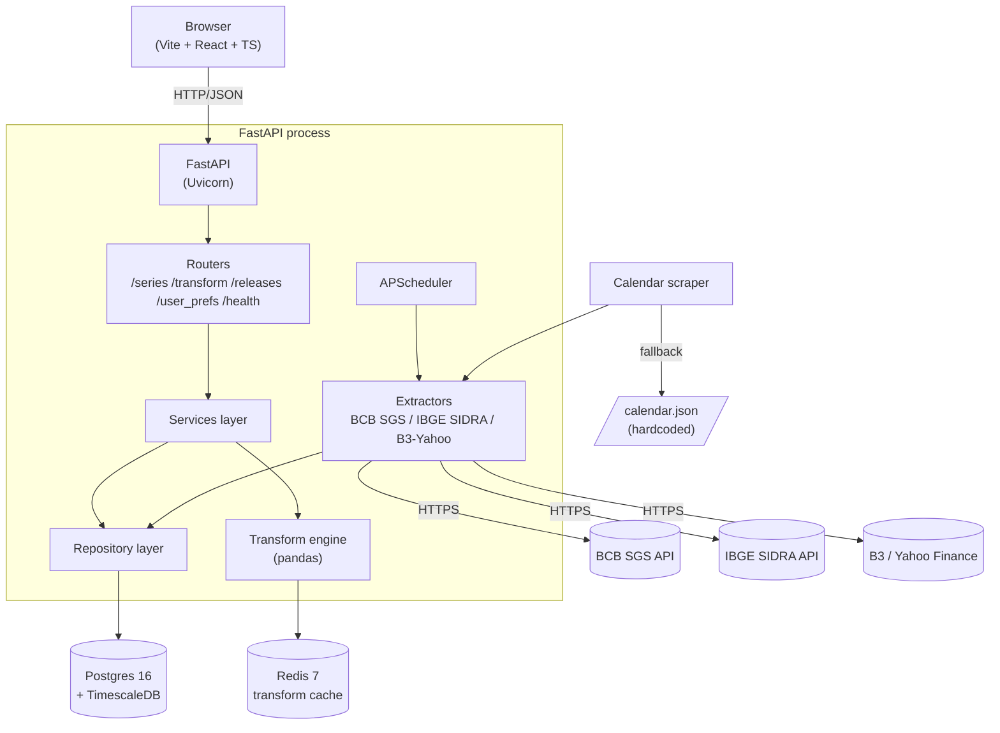
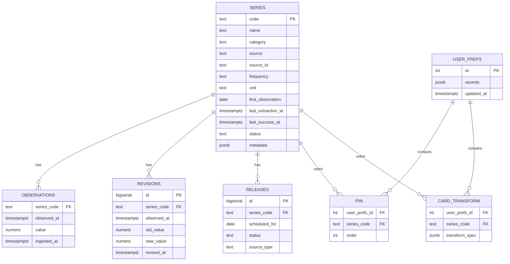
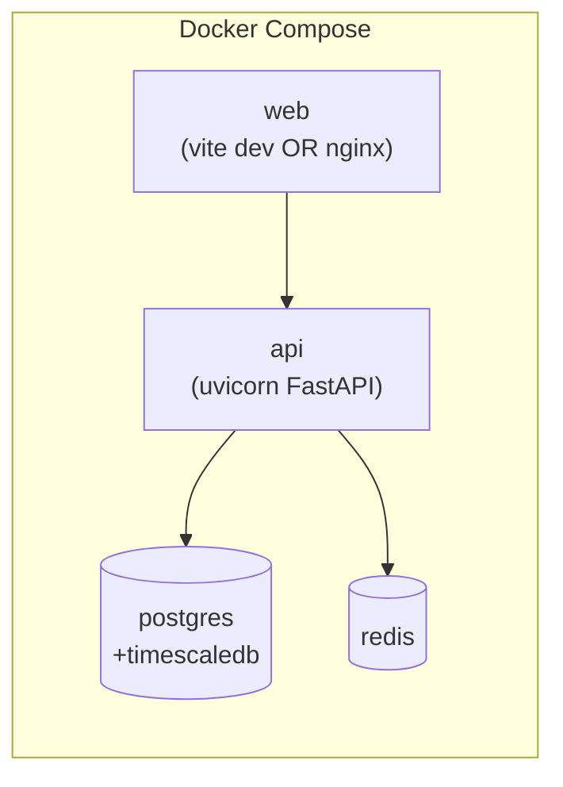

# API-extractor — System Design

**Version:** v1
**Date:** 2026-05-11
**Spec:** `specs/api-extractor.spec.md`

---

## 1. Requirements summary

### Functional
- Scheduled extraction from **5 sources**: BCB SGS, IBGE SIDRA, B3 portal, Yahoo Finance (BR + intl), ANBIMA bulk XLSX
- Time-series storage with revision history + per-measure isolation
- On-demand pandas transforms (variation, smoothing, windows, normalization)
- REST API with OpenAPI
- React/TS frontend: Painel + Diariamente row, Índices w/ AnalysisPanel, Calendário w/ DailyTable + DayDetailModal, Metadados dossier
- Pin/unpin + per-card transform spec persisted server-side
- Release calendar (scraped + hardcoded fallback)

### Non-functional
- p95 observations endpoint ≤ 200ms (cached)
- p95 transform endpoint ≤ 800ms (uncached, ≤100k obs)
- Painel initial render ≤ 1.5s
- **72/72 series coverage** with viable history per source
- Stale detection + retry resilience (status flag stops scheduler retry on dead upstream)
- Single-user local deploy via Docker Compose

### Constraints
- pt-BR UI, English code
- No auth in v1 (placeholder for later)
- Personal workspace, low traffic

---

## 2. High-level architecture



---

## 3. Component breakdown

### 3.1 Frontend (Vite + React + TS)
- **Build:** Vite dev server (port 5173) → static bundle in prod
- **State:** TanStack Query for server cache + Zustand (or Context) for UI state
- **Types:** Generated from FastAPI OpenAPI via `openapi-typescript`
- **Routing:** `react-router-dom` v6 (replaces state-based router from doc proto)
- **Styling:** CSS variables matching doc §8 tokens; CSS modules or vanilla
- **Charts:** Inline SVG sparklines (no chart lib needed for 24-point lines)

### 3.2 Backend (FastAPI process)
Single-process monolith. Threads via uvicorn + asyncio for HTTP I/O; background scheduler runs in same event loop via `AsyncIOScheduler`.

Layers:
- **Routers** — HTTP entry, Pydantic request/response models
- **Services** — business logic (transforms, pin/unpin, freshness queries)
- **Repositories** — SQL access via SQLAlchemy 2.x async
- **Extractors** — adapter pattern, 5 implementations:
  - `BCBSGSAdapter` — JSON over httpx, per-date chunking for 10y windows, defensive parse for error envelopes
  - `IBGESidraAdapter` — URL builder w/ variable + classification map (`IBGE_VARIABLE_MAP`)
  - `B3YahooAdapter` — yfinance sync wrapped in `asyncio.to_thread`, UTC midnight tz normalization
  - `B3PortalAdapter` — base64-encoded JSON to `indexStatisticsProxy/IndexCall/GetPortfolioDay`, pt-BR decimal parse
  - `ANBIMABulkAdapter` — single XLSX download per index from `s3-data-prd-use1-precos`, pandas+openpyxl parse
- **TransformEngine** — pandas pipeline with registry of 17 transform ops
- **Scheduler** — `AsyncIOScheduler` w/ SQLAlchemyJobStore (3 jobs persisted)

### 3.3 Data layer
- **Postgres 16** — primary store
- **TimescaleDB extension** — `observations` table as hypertable partitioned by `observed_at`, PK includes `measure_key` (Phase 18)
- **Redis 7** — transform result cache, key = `transform:{series_code}:{spec_hash}:{latest_observed_at}`

### 3.4 External sources
- **BCB SGS**: `https://api.bcb.gov.br/dados/serie/bcdata.sgs.{id}/dados?formato=json` — no auth, 10y window cap → chunked
- **IBGE SIDRA**: `https://apisidra.ibge.gov.br/values/t/{table}/n1/all/v/{var}/p/{period}/c{class}/{code}` — no auth
- **B3 portal**: `https://sistemaswebb3-listados.b3.com.br/indexStatisticsProxy/IndexCall/GetPortfolioDay/{base64}` — no auth, Mozilla UA
- **Yahoo Finance** via `yfinance==1.3.0` — covers Ibovespa, IFIX (proxy XFIX11.SA), + 8 intl indexes (^GSPC, ^DJI, ^IXIC, ^NDX, URTH, EEM, ^STOXX50E, ^SPESG)
- **ANBIMA**: `https://s3-data-prd-use1-precos.s3.us-east-1.amazonaws.com/arquivos/indices-historico/{CODE}-HISTORICO.xls` — no auth, full history per file

---

## 4. Data model



`OBSERVATIONS` is a TimescaleDB hypertable; primary key `(series_code, observed_at)`, with unique constraint enforced.

---

## 5. API surface

| Method | Path | Purpose |
|----|----|----|
| GET  | `/series` | List with status + metadata |
| GET  | `/series/{code}` | Single series metadata |
| GET  | `/series/{code}/observations?from=&to=&limit=` | Raw obs |
| POST | `/series/{code}/transform` | Apply transform, body=`TransformSpec` |
| GET  | `/releases?month=YYYY-MM&category=` | Calendar events |
| GET  | `/user_prefs` | Pins + transforms + recents |
| PATCH | `/user_prefs` | Update pins/transforms/recents |
| POST | `/admin/extract/{code}` | Manual trigger |
| GET  | `/health` | Per-series freshness |

---

## 6. Transform engine

Registry pattern:

```python
TRANSFORMS = {
    "level": lambda s, p: s,
    "mom":   lambda s, p: s.pct_change(1) * 100,
    "yoy":   lambda s, p: s.pct_change(periods_per_year(s)) * 100,
    "ma":    lambda s, p: s.rolling(p["window"]).mean(),
    "ewma":  lambda s, p: s.ewm(span=p["span"]).mean(),
    "accum12": lambda s, p: ((1 + s/100).rolling(12).apply(np.prod) - 1) * 100,
    "zscore":  lambda s, p: (s - s.mean()) / s.std(),
    # ...
}
```

Pipeline: load obs → apply transform → detect NaN gaps → return `{values, metadata: {gaps: [...]}}`. Cache key = SHA256 of `(series_code, transform_spec, latest_observed_at)`.

---

## 7. Scheduling

`AsyncIOScheduler` registers jobs at app startup:
- Daily series: cron `0 18 * * 1-5` BRT (after market close)
- Monthly/quarterly: cron `0 9 * * *` (poll daily for new releases — release dates not always exact)
- Calendar refresh: cron `0 3 * * 0` (weekly Sunday 03:00)

Each job runs in extractor adapter with `tenacity` retry (3x, 2s/8s/30s exponential).

---

## 8. Failure modes + mitigations

| Failure | Mitigation |
|----|----|
| Upstream API timeout/5xx | tenacity retry → mark `stale` → log → UI badge |
| Upstream returns malformed payload | Pydantic validation → skip update, log ERROR, keep last known good |
| Postgres down | Healthcheck fails → UI banner; FastAPI returns 503 |
| Redis down | Bypass cache, compute fresh, log WARN (degrade gracefully) |
| Scheduler missed run | APScheduler `misfire_grace_time=3600`; retry on next tick |
| Calendar scrape fails | Fallback to hardcoded `calendar.json` |
| Transform numeric overflow | Catch + return 422 with diagnostic |
| Concurrent backfill | Advisory lock on `series_code` (pg_advisory_lock) |

---

## 9. Operational topology



Single host. No orchestrator. Logs to stdout → captured by Docker. Volumes for Postgres + Redis persistence.

---

## 10. Risks + mitigations

| Risk | Likelihood | Impact | Mitigation |
|----|----|----|----|
| BCB SGS API changes format | Low | High | Pydantic validation + contract tests |
| IBGE SIDRA rate limits | Medium | Medium | Throttle + spread monthly fetches across day |
| TimescaleDB extension upgrade pain | Low | Medium | Pin version, document migration path |
| Pandas perf on long histories | Low | Low | Cache + only transform requested ranges |
| Calendar dates drift | Medium | Low | Weekly refresh + manual override field |
| Single-user → multi-user later | High | Medium | Schema already has `user_prefs.id`; add `user_id` FK in future migration |

---

## 11. Future evolution

- **v2 auth:** add `users` table, FK from `user_prefs`, JWT via fastapi-users
- **v2 deeper analytics:** dedicated `analyses` table for saved transforms
- **v2 alerts:** outbox pattern, simple email/webhook on release/threshold
- **v3 multi-tenant:** RLS in Postgres or per-tenant schema
- **v3 if scale grows:** split scheduler into separate worker (Celery+Redis), use SSE for live updates
